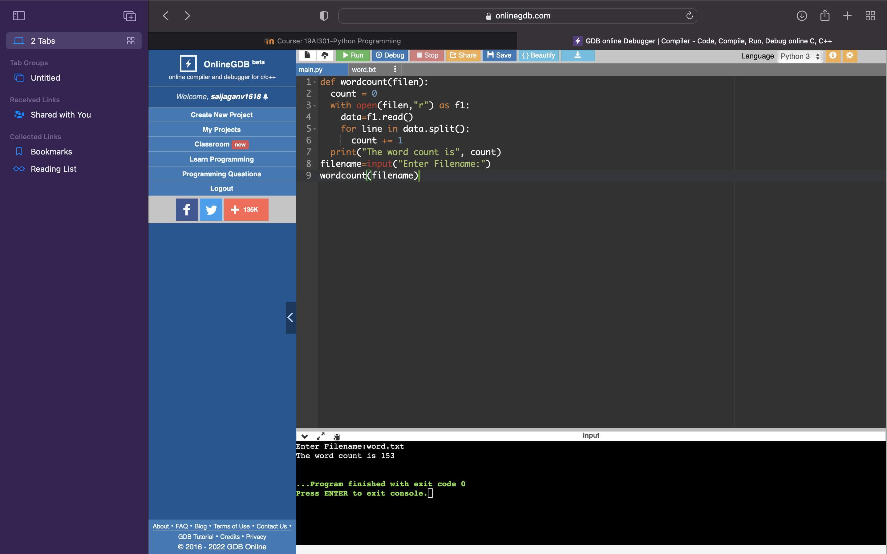

# Word-count
## AIM:
To write a python program for getting the word count from a text.
## EQUIPEMENT'S REQUIRED: 
PC
Anaconda - Python 3.7
## ALGORITHM: 
### Step 1:
open a file and give name
### Step 2: 
 give the data in the 2nd file
### Step 3: 
then give the data.split
### Step 4:  
finally print and gie the filename.

## PROGRAM:
~~~
def wordcount(filen):
  count = 0
  with open(filen,"r") as f1:
    data=f1.read()
    for line in data.split():
      count += 1
  print("The word count is", count)
filename=input("Enter Filename:")
wordcount(filename)
~~~
### OUTPUT:

## RESULT:
Thus the program is written to find the word count from a text.
